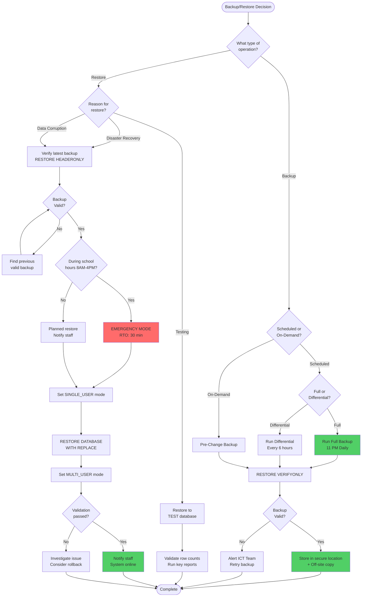
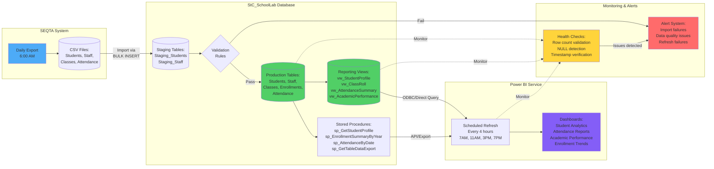
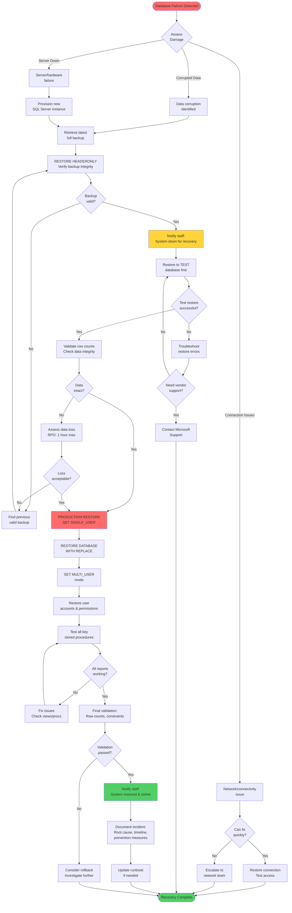

# StC SchoolLab Database - Operational Runbook

- **Database:** StC_SchoolLab
- **Environment:** SQL Server Express (Local Development)
- **Owner:** ICT Department
- **Last Updated:** December 2025

---

## Table of Contents
1. [Backup Procedures](#1-backup-procedures)
2. [Restore Procedures](#2-restore-procedures)
3. [Running Key Reports](#3-running-key-reports)
4. [Common Incidents & Troubleshooting](#4-common-incidents--troubleshooting)
5. [Permissions & Security Principles](#5-permissions--security-principles)
6. [System Integration Monitoring](#6-system-integration-monitoring)

---

## 1. Backup Procedures

### 1.1 Why Backups Matter
- **Child Safety Compliance:** Student data must be recoverable in case of system failure
- **Business Continuity:** School operations depend on accurate attendance, enrollment, and academic records
- **Audit Trail:** Regulatory requirements mandate data retention and recovery capability

### 1.2 Backup Schedule (Recommended)
- **Full Backup:** Daily at 11:00 PM (after school operations)
- **Differential Backup:** Every 6 hours during school day (7 AM, 1 PM, 7 PM)
- **Transaction Log Backup:** Every 15 minutes (if using Full Recovery Model)

### 1.3 Method 1: T-SQL Backup (Automated)

#### Full Backup
```sql
-- Full database backup (SQL Server Express does not support COMPRESSION)
BACKUP DATABASE StC_SchoolLab
TO DISK = '/var/opt/mssql/backup/StC_SchoolLab_Full.bak'
WITH 
    FORMAT,
    NAME = 'StC_SchoolLab Full Backup',
    DESCRIPTION = 'Full backup of school database',
    STATS = 10;
GO

-- Verify backup
RESTORE VERIFYONLY 
FROM DISK = '/var/opt/mssql/backup/StC_SchoolLab_Full.bak';
GO
```

#### Differential Backup
```sql
-- Differential backup (captures changes since last full backup)
BACKUP DATABASE StC_SchoolLab
TO DISK = '/var/opt/mssql/backup/StC_SchoolLab_Diff.bak'
WITH 
    DIFFERENTIAL,
    FORMAT,
    NAME = 'StC_SchoolLab Differential Backup',
    STATS = 10;
GO
```

#### macOS Command Line Execution
```bash
# Full backup (Note: SQL Server Express does not support COMPRESSION)
/opt/homebrew/bin/sqlcmd -S localhost -U sa -P 'StC_SchoolLab2025!' -C -Q \
  "BACKUP DATABASE StC_SchoolLab TO DISK = '/var/opt/mssql/backup/StC_SchoolLab_Full_$(date +%Y%m%d_%H%M%S).bak' WITH FORMAT;"

# Verify backup exists
ls -lh /var/opt/mssql/backup/StC_SchoolLab_Full_*.bak
```

### 1.4 Method 2: SQL Server Management Studio (GUI)

#### Steps
1. Connect to SQL Server instance
2. Right-click **StC_SchoolLab** database → **Tasks** → **Back Up...**
3. Configure backup settings:
   - **Backup type:** Full
   - **Destination:** Add → `/var/opt/mssql/backup/StC_SchoolLab_Full.bak`
   - **Options:** ⚠️ Note: "Compress backup" is not available in SQL Server Express Edition
4. Click **OK** to execute
5. Verify completion in **Messages** tab

### 1.5 Backup Validation Checklist
- [ ] Backup file created successfully (check file size > 0 bytes)
- [ ] RESTORE VERIFYONLY completed without errors
- [ ] Backup file stored in secure location with restricted access
- [ ] Backup retention policy enforced (keep 30 days minimum)
- [ ] Off-site backup copy created (cloud storage or external drive)

### 1.6 Backup/Restore Decision Tree



---

## 2. Restore Procedures

### 2.1 RPO/RTO Considerations
- **RPO (Recovery Point Objective):** Maximum 1 hour of data loss acceptable
- **RTO (Recovery Time Objective):** Database must be restored within 30 minutes
- **Critical Period:** During school hours (8 AM - 4 PM), prioritize immediate recovery

### 2.2 Emergency Restore Procedure

### ⚠️ CRITICAL: Always restore to a test database first to verify backup integrity

### Step 1: Verify Backup File
```sql
-- Check backup file contents
RESTORE HEADERONLY 
FROM DISK = '/var/opt/mssql/backup/StC_SchoolLab_Full.bak';

RESTORE FILELISTONLY 
FROM DISK = '/var/opt/mssql/backup/StC_SchoolLab_Full.bak';
```

### Step 2: Restore to Test Database
```sql
-- Restore to test database first
RESTORE DATABASE StC_SchoolLab_TEST
FROM DISK = '/var/opt/mssql/backup/StC_SchoolLab_Full.bak'
WITH 
    MOVE 'StC_SchoolLab' TO '/var/opt/mssql/data/StC_SchoolLab_TEST.mdf',
    MOVE 'StC_SchoolLab_log' TO '/var/opt/mssql/data/StC_SchoolLab_TEST_log.ldf',
    REPLACE,
    STATS = 10;
GO

-- Validate data integrity
USE StC_SchoolLab_TEST;
SELECT 'Students' AS TableName, COUNT(*) AS RowCount FROM Students
UNION ALL SELECT 'Staff', COUNT(*) FROM Staff
UNION ALL SELECT 'Classes', COUNT(*) FROM Classes
UNION ALL SELECT 'Enrollments', COUNT(*) FROM Enrollments
UNION ALL SELECT 'Attendance', COUNT(*) FROM Attendance;
```

### Step 3: Production Restore (After Validation)
```sql
-- Set database to single-user mode (disconnect all users)
USE master;
ALTER DATABASE StC_SchoolLab SET SINGLE_USER WITH ROLLBACK IMMEDIATE;
GO

-- Restore production database
RESTORE DATABASE StC_SchoolLab
FROM DISK = '/var/opt/mssql/backup/StC_SchoolLab_Full.bak'
WITH 
    REPLACE,
    STATS = 10;
GO

-- Return to multi-user mode
ALTER DATABASE StC_SchoolLab SET MULTI_USER;
GO
```

### macOS Command Line Restore
```bash
# Emergency restore (use with caution)
/opt/homebrew/bin/sqlcmd -S localhost -U sa -P 'StC_SchoolLab2025!' -C -Q \
  "USE master; ALTER DATABASE StC_SchoolLab SET SINGLE_USER WITH ROLLBACK IMMEDIATE; RESTORE DATABASE StC_SchoolLab FROM DISK = '/var/opt/mssql/backup/StC_SchoolLab_Full.bak' WITH REPLACE; ALTER DATABASE StC_SchoolLab SET MULTI_USER;"
```

### 2.3 Post-Restore Validation
- [ ] All tables have expected row counts
- [ ] Key reports execute without errors
- [ ] Foreign key constraints are intact
- [ ] Views and stored procedures are accessible
- [ ] User permissions are correctly applied
- [ ] Notify staff that system is back online

---

## 3. Running Key Reports

### 3.1 Student Profile Report

#### Purpose
Comprehensive student lookup for counselors, teachers, and admin staff

#### Stored Procedure
`sp_GetStudentProfile`

#### Parameters
- `@StudentId` (INT, required): Student's unique identifier

#### Execution
```bash
/opt/homebrew/bin/sqlcmd -S localhost -U sa -P 'StC_SchoolLab2025!' -C -Q \
  "USE StC_SchoolLab; EXEC sp_GetStudentProfile @StudentId = 1;"
```

#### Output
3 result sets
1. **Student Profile:** Personal details, contact info, enrollment summary, attendance rate
2. **Current Enrollments:** All classes, subjects, teachers, grades, status
3. **Recent Attendance:** Last 30 days of attendance records

#### Common Use Cases
- Parent-teacher conferences (attendance and grade review)
- Student counseling sessions (academic performance tracking)
- Enrollment verification (class schedules and teacher assignments)

---

### 3.2 Year-Level Enrollment Summary

#### Purpose
Class capacity planning and resource allocation for leadership

#### Stored Procedure
`sp_EnrollmentSummaryByYear`

#### Parameters
- `@YearLevel` (INT, required): Year level (7-12)

#### Execution
```bash
/opt/homebrew/bin/sqlcmd -S localhost -U sa -P 'StC_SchoolLab2025!' -C -Q \
  "USE StC_SchoolLab; EXEC sp_EnrollmentSummaryByYear @YearLevel = 8;"
```

#### Output
2 result sets
1. **Class-Level Details:** Each class with enrollment counts, capacity utilization, status
2. **Year-Level Summary:** Total classes, subjects, teachers, capacity, utilization percentage

#### Common Use Cases
- Semester planning (class size balancing)
- Teacher workload analysis (class assignments per teacher)
- Capacity forecasting (identifying under-enrolled or full classes)

#### Capacity Status Indicators
- **Full:** 100% capacity (no seats available)
- **Near Capacity:** 90-99% capacity (limited seats)
- **Available:** 50-89% capacity (seats available)
- **Under-enrolled:** <50% capacity (consider consolidation)

---

### 3.3 Daily Attendance Report

#### Purpose
Daily roll call verification and absence follow-up

#### Stored Procedure
`sp_AttendanceByDate`

#### Parameters
- `@Date` (DATE, required): Attendance date (format: 'YYYY-MM-DD')

#### Execution
```bash
/opt/homebrew/bin/sqlcmd -S localhost -U sa -P 'StC_SchoolLab2025!' -C -Q \
  "USE StC_SchoolLab; EXEC sp_AttendanceByDate @Date = '2025-01-15';"
```

#### Output
3 result sets
1. **Attendance Records:** All attendance entries with student/class/teacher details
2. **Daily Summary:** Total marked, present/absent/late/excused counts, attendance rate
3. **Absent Students:** Students with absences, contact information for follow-up

#### Common Use Cases
- Morning roll call verification (compliance reporting)
- Absence follow-up (parent contact for unexplained absences)
- Attendance trend analysis (identifying chronic absenteeism)

#### ⚠️ Child Safety Note
Unexplained absences require immediate follow-up per school policy

---

### 3.4 Data Export for External Systems

#### Purpose
Export data for SEQTA, Power BI, or backup purposes

#### Stored Procedure
`sp_GetTableDataExport`

#### Parameters
- `@TableName` (NVARCHAR, required): Table or view name (case-insensitive)
- `@TopN` (INT, optional): Limit rows returned (default: all rows)

#### Supported Tables/Views
- STUDENTS, STAFF, CLASSES, ENROLLMENTS, ATTENDANCE
- VW_STUDENTPROFILE, VW_ACADEMICPERFORMANCE

#### Execution
```bash
# Export top 100 students
/opt/homebrew/bin/sqlcmd -S localhost -U sa -P 'StC_SchoolLab2025!' -C -Q \
  "USE StC_SchoolLab; EXEC sp_GetTableDataExport @TableName = 'STUDENTS', @TopN = 100;"

# Export all attendance records
/opt/homebrew/bin/sqlcmd -S localhost -U sa -P 'StC_SchoolLab2025!' -C -Q \
  "USE StC_SchoolLab; EXEC sp_GetTableDataExport @TableName = 'ATTENDANCE';"
```

#### Output
2 result sets
1. **Data Export:** Requested table/view data with human-readable joins
2. **Export Metadata:** Table name, timestamp, row count

#### Common Use Cases
- SEQTA integration (student/staff data synchronization)
- Power BI refresh (reporting dashboard updates)
- Data validation (cross-system reconciliation)

#### Note
Returns SQL result sets; client tools handle CSV serialization

---

## 4. Common Incidents & Troubleshooting

### 4.1 Report Numbers Don't Match

#### Scenario
Attendance report shows different totals than SEQTA

#### Troubleshooting Steps
1. **Verify Date Range:** Ensure both systems use the same date filter
   ```sql
   -- Check attendance date range in our system
   SELECT MIN(attendance_date) AS earliest, MAX(attendance_date) AS latest
   FROM Attendance;
   ```

2. **Check for Duplicates:** Multiple attendance records for same student/class/date
   ```sql
   -- Find duplicate attendance records
   SELECT student_id, class_id, attendance_date, COUNT(*) AS duplicate_count
   FROM Attendance
   GROUP BY student_id, class_id, attendance_date
   HAVING COUNT(*) > 1;
   ```

3. **Validate Status Values:** Ensure status codes match between systems
   ```sql
   -- Check distinct attendance statuses
   SELECT DISTINCT status, COUNT(*) AS count
   FROM Attendance
   GROUP BY status;
   ```

4. **Compare Row Counts:** Identify missing or extra records
   ```sql
   -- Total attendance records by date
   SELECT attendance_date, COUNT(*) AS total_records
   FROM Attendance
   GROUP BY attendance_date
   ORDER BY attendance_date DESC;
   ```

#### Resolution
Document discrepancies, identify root cause (import timing, data transformation logic), reconcile with source system

---

### 4.2 Import Failed Halfway

#### Scenario
SEQTA CSV import fails mid-process, leaving partial data

#### Troubleshooting Steps
1. **Check Error Log:** Review SQL Server error log for failure details
   ```sql
   -- View recent error messages
   EXEC sp_readerrorlog 0, 1, 'error';
   ```

2. **Verify Staging Table State:** Check if partial data was inserted
   ```sql
   -- Check staging table row count
   SELECT 'Staging_Students' AS StagingTable, COUNT(*) AS RowCount 
   FROM Staging_Students;
   ```

3. **Rollback Partial Import:** Clear staging table and restart
   ```sql
   -- Clear staging table
   TRUNCATE TABLE Staging_Students;
   ```

4. **Validate CSV File:** Check for encoding issues, malformed rows, missing columns
   - Open CSV in text editor (not Excel) to check raw format
   - Verify column count matches table definition
   - Check for special characters or line breaks in data

#### Prevention
- Use transactions for imports (ROLLBACK on error)
- Validate CSV structure before import
- Log import progress to tracking table
- Keep original CSV file for re-import

---

### 4.3 Duplicate Student Records

#### Scenario
Same student appears multiple times with different IDs

#### Troubleshooting Steps
1. **Identify Duplicates:** Find students with matching names/DOB
   ```sql
   -- Find potential duplicate students
   SELECT first_name, last_name, date_of_birth, COUNT(*) AS duplicate_count
   FROM Students
   GROUP BY first_name, last_name, date_of_birth
   HAVING COUNT(*) > 1;
   ```

2. **Review Related Records:** Check enrollments, attendance for each duplicate
   ```sql
   -- Check enrollments for duplicate student IDs
   SELECT student_id, COUNT(*) AS enrollment_count
   FROM Enrollments
   WHERE student_id IN (SELECT student_id FROM Students WHERE last_name = 'Smith')
   GROUP BY student_id;
   ```

3. **Merge Strategy:** Identify canonical record, reassign foreign keys
   ```sql
   -- Example: Merge student_id 150 into student_id 1
   BEGIN TRANSACTION;
   
   -- Update enrollments
   UPDATE Enrollments SET student_id = 1 WHERE student_id = 150;
   
   -- Update attendance
   UPDATE Attendance SET student_id = 1 WHERE student_id = 150;
   
   -- Delete duplicate student record
   DELETE FROM Students WHERE student_id = 150;
   
   COMMIT;
   ```

4. **Prevent Future Duplicates:** Add unique constraint on student_number
   ```sql
   -- Add unique constraint
   ALTER TABLE Students
   ADD CONSTRAINT UQ_Students_StudentNumber UNIQUE (student_number);
   ```

#### ⚠️ CRITICAL
Always backup database before merging records

---

### 4.4 Performance Issue on Report Query

#### Scenario
Report takes >30 seconds to run, staff complaining about slow response

#### Troubleshooting Steps
1. **Identify Slow Query:** Enable execution plan in SSMS or use SET STATISTICS
   ```sql
   -- Enable execution time statistics
   SET STATISTICS TIME ON;
   SET STATISTICS IO ON;
   
   -- Run slow query
   SELECT * FROM vw_StudentProfile;
   
   SET STATISTICS TIME OFF;
   SET STATISTICS IO OFF;
   ```

2. **Check for Missing Indexes:** Look for table scans in execution plan
   ```sql
   -- Find missing indexes
   SELECT 
       OBJECT_NAME(d.object_id) AS TableName,
       d.equality_columns,
       d.inequality_columns,
       d.included_columns,
       s.avg_user_impact,
       s.user_seeks
   FROM sys.dm_db_missing_index_details d
   INNER JOIN sys.dm_db_missing_index_groups g ON d.index_handle = g.index_handle
   INNER JOIN sys.dm_db_missing_index_group_stats s ON g.index_group_handle = s.group_handle
   WHERE d.database_id = DB_ID('StC_SchoolLab')
   ORDER BY s.avg_user_impact DESC;
   ```

3. **Add Targeted Indexes:** Create indexes on high-traffic join/filter columns
   ```sql
   -- Example: Add index on Attendance.student_id and attendance_date
   CREATE NONCLUSTERED INDEX IX_Attendance_StudentId_Date
   ON Attendance (student_id, attendance_date)
   INCLUDE (status);
   ```

4. **Optimize Query Logic:** Rewrite query to avoid row-by-row operations
   - Replace correlated subqueries with JOINs or APPLY
   - Use EXISTS instead of IN for large subqueries
   - Filter early (WHERE before JOIN when possible)

#### Performance Targets
- Simple lookups: <1 second
- Aggregated reports: <5 seconds
- Complex analytics: <30 seconds

---

### 4.5 Missing Data in Power BI Reports

#### Scenario
Power BI dashboard shows blank/NULL values for recent data

#### Troubleshooting Steps
1. **Verify Source Data:** Check if data exists in database
   ```sql
   -- Check recent attendance records
   SELECT TOP 10 *
   FROM Attendance
   ORDER BY attendance_date DESC;
   ```

2. **Check View Definitions:** Ensure views include recent data
   ```sql
   -- Test view directly
   SELECT COUNT(*) AS RowCount
   FROM vw_StudentProfile
   WHERE student_id = 1;
   ```

3. **Validate Power BI Refresh:** Check last refresh timestamp in Power BI
   - Open Power BI Desktop → Transform Data → Data Source Settings
   - Verify connection string and credentials
   - Manually trigger refresh to test

4. **Trace Data Lineage:** Follow data from source → staging → production → view → Power BI
   ```sql
   -- Check data flow timestamps
   SELECT 'Students' AS Source, MAX(student_id) AS LastID FROM Students
   UNION ALL SELECT 'Enrollments', MAX(enrollment_id) FROM Enrollments
   UNION ALL SELECT 'Attendance', MAX(attendance_id) FROM Attendance;
   ```

#### Common Causes
- Scheduled refresh failed (check Power BI service logs)
- View filter excludes recent data (check WHERE clauses)
- Data type mismatch (NULL values from failed conversions)
- Permissions issue (Power BI service account lacks view access)

---

## 5. Permissions & Security Principles

### 5.1 Least Privilege Access Model

#### Principle
Grant minimum permissions required for job function

#### Access Levels

| Role | Access | Permissions |
|------|--------|-------------|
| **ICT Admin** | Full database access | db_owner |
| **Leadership** | Read-only views, stored procedures | EXECUTE on procs, SELECT on views |
| **Teachers** | Class-specific data only | SELECT on vw_ClassRoll (filtered by staff_id) |
| **Admin Staff** | Student profiles, enrollment reports | EXECUTE on sp_GetStudentProfile, sp_EnrollmentSummaryByYear |
| **External Systems** | Data export only | EXECUTE on sp_GetTableDataExport |

### 5.2 Child Data Protection

#### ⚠️ CRITICAL REQUIREMENTS
- **No direct table access** for non-ICT staff (use views/procedures only)
- **Audit logging** for all student data access (implement trigger-based logging)
- **Encrypted backups** stored in secure location with restricted access
- **Data masking** for sensitive fields (phone numbers, addresses) in non-production environments
- **Access review** quarterly to remove inactive accounts

### 5.3 Creating Restricted User Accounts

#### Example: Teacher Account (Read-Only Class Data)
```sql
-- Create login
CREATE LOGIN teacher_user WITH PASSWORD = 'SecurePassword123!';

-- Create database user
USE StC_SchoolLab;
CREATE USER teacher_user FOR LOGIN teacher_user;

-- Grant view access only
GRANT SELECT ON vw_ClassRoll TO teacher_user;
GRANT SELECT ON vw_AttendanceSummary TO teacher_user;

-- Deny direct table access
DENY SELECT ON Students TO teacher_user;
DENY SELECT ON Attendance TO teacher_user;
```

#### Example: Admin Staff Account (Stored Procedure Access)
```sql
-- Create login
CREATE LOGIN admin_user WITH PASSWORD = 'SecurePassword456!';

-- Create database user
USE StC_SchoolLab;
CREATE USER admin_user FOR LOGIN admin_user;

-- Grant procedure execution only
GRANT EXECUTE ON sp_GetStudentProfile TO admin_user;
GRANT EXECUTE ON sp_EnrollmentSummaryByYear TO admin_user;
GRANT EXECUTE ON sp_AttendanceByDate TO admin_user;

-- Deny direct table access
DENY SELECT ON Students TO admin_user;
DENY SELECT ON Enrollments TO admin_user;
```

### 5.4 Audit Logging (Recommended Implementation)

```sql
-- Create audit log table
CREATE TABLE AuditLog (
    audit_id INT IDENTITY(1,1) PRIMARY KEY,
    event_time DATETIME2 DEFAULT GETDATE(),
    user_name NVARCHAR(128),
    action_type NVARCHAR(50),
    table_name NVARCHAR(128),
    record_id INT,
    details NVARCHAR(MAX)
);

-- Example trigger for student data access
CREATE TRIGGER trg_Students_Audit
ON Students
AFTER SELECT
AS
BEGIN
    INSERT INTO AuditLog (user_name, action_type, table_name, details)
    VALUES (SYSTEM_USER, 'SELECT', 'Students', 'Student data accessed');
END;
```

---

## 6. System Integration Monitoring

### 6.1 SEQTA Import Monitoring

#### Import Schedule
Daily at 6:00 AM (before school starts)

#### Health Checks
```sql
-- Check last import timestamp
SELECT 
    'Students' AS ImportSource,
    MAX(created_date) AS LastImport,
    COUNT(*) AS TotalRecords
FROM Students
UNION ALL
SELECT 'Staff', MAX(created_date), COUNT(*) FROM Staff;

-- Verify import row counts match expected
-- (Compare with SEQTA export row count)
```

#### Alert Conditions
- Import hasn't run in 24+ hours
- Row count decreased (data loss indicator)
- Duplicate records detected
- Import error logged in staging table

### 6.2 Power BI Data Warehouse Feed

#### Refresh Schedule
Every 4 hours during school day (7 AM, 11 AM, 3 PM, 7 PM)

#### Health Checks
```sql
-- Verify views are accessible
SELECT 'vw_StudentProfile' AS ViewName, COUNT(*) AS RowCount FROM vw_StudentProfile
UNION ALL SELECT 'vw_ClassRoll', COUNT(*) FROM vw_ClassRoll
UNION ALL SELECT 'vw_AttendanceSummary', COUNT(*) FROM vw_AttendanceSummary
UNION ALL SELECT 'vw_AcademicPerformance', COUNT(*) FROM vw_AcademicPerformance;

-- Check for NULL values in critical fields
SELECT 
    COUNT(*) AS total_students,
    SUM(CASE WHEN first_name IS NULL THEN 1 ELSE 0 END) AS missing_first_name,
    SUM(CASE WHEN last_name IS NULL THEN 1 ELSE 0 END) AS missing_last_name,
    SUM(CASE WHEN student_number IS NULL THEN 1 ELSE 0 END) AS missing_student_number
FROM Students;
```

#### Alert Conditions
- View returns 0 rows (data pipeline broken)
- Critical fields contain NULLs (data quality issue)
- Refresh fails 2+ consecutive times

### 6.3 SEQTA/Power BI Data Integration Flow



**Key Integration Points:**
1. **SEQTA → Staging:** Daily CSV import at 6 AM with validation
2. **Staging → Production:** Merge validated records, handle duplicates
3. **Production → Views:** Real-time aggregation for reporting
4. **Views → Power BI:** Scheduled refresh every 4 hours during school day
5. **Monitoring:** Continuous health checks with automated alerting

**Data Flow Validation:**
- Row count reconciliation at each stage
- Timestamp tracking for import/refresh cycles
- NULL value detection in critical fields
- Duplicate detection and resolution

### 6.4 Database Health Monitoring

#### Daily Checks
```sql
-- Check database size and growth
EXEC sp_spaceused;

-- Check for blocking/long-running queries
SELECT 
    session_id,
    blocking_session_id,
    wait_type,
    wait_time,
    last_wait_type,
    SUBSTRING(text, statement_start_offset/2, 
        (CASE WHEN statement_end_offset = -1 
            THEN LEN(CONVERT(nvarchar(max), text)) * 2 
            ELSE statement_end_offset 
        END - statement_start_offset)/2) AS query_text
FROM sys.dm_exec_requests
CROSS APPLY sys.dm_exec_sql_text(sql_handle)
WHERE session_id > 50
  AND wait_time > 5000;  -- Queries waiting >5 seconds

-- Check backup history
SELECT TOP 5
    database_name,
    backup_start_date,
    backup_finish_date,
    DATEDIFF(SECOND, backup_start_date, backup_finish_date) AS duration_seconds,
    backup_size / 1024 / 1024 AS backup_size_mb,
    type AS backup_type
FROM msdb.dbo.backupset
WHERE database_name = 'StC_SchoolLab'
ORDER BY backup_start_date DESC;
```

---

## 7. Emergency Contacts

| Role | Contact | Availability |
|------|---------|--------------|
| **ICT Manager** | [Name] - [Phone] | Mon-Fri 8 AM - 5 PM |
| **Database Admin** | [Name] - [Phone] | Mon-Fri 7 AM - 6 PM |
| **After-Hours Support** | [On-call Phone] | Weekends/Holidays |
| **Vendor Support (SQL Server)** | Microsoft Support | 24/7 (paid support plan) |

---

## 8. Change Management

#### Before making ANY changes to production
1. ✅ Backup database (full backup + verification)
2. ✅ Test change in development environment
3. ✅ Document change in change log
4. ✅ Notify affected staff (email + Teams announcement)
5. ✅ Schedule change during low-usage window (after 4 PM or weekends)
6. ✅ Prepare rollback plan (restore procedure ready)
7. ✅ Validate change post-deployment (run key reports)

#### Change Log Location
[Complete changelog with 30+ commits](https://github.com/search?q=repo%3Alfariabr%2Fmasters-swe-ai++stc+OR+%28stc%29+OR+std+OR+%28std%29&type=commits&s=committer-date&o=desc)

---

## 9. Disaster Recovery Plan

#### Scenario: Complete Database Loss

#### Recovery Steps
1. **Assess Damage:** Determine if database is corrupted or server is down
2. **Retrieve Latest Backup:** Get most recent full backup from secure storage
3. **Provision New Server:** If hardware failure, set up new SQL Server instance
4. **Restore Database:** Follow [Section 2.2](#22-emergency-restore-procedure)
5. **Validate Data:** Run validation queries to confirm data integrity
6. **Restore Permissions:** Re-create user accounts and permissions
7. **Test Reports:** Execute all key stored procedures to verify functionality
8. **Notify Staff:** Announce system restoration and any data loss window
9. **Post-Mortem:** Document incident, root cause, and prevention measures

#### Maximum Acceptable Data Loss
1 hour (based on backup schedule)

#### Maximum Downtime
30 minutes (based on restore time + validation)

### 9.1 Disaster Recovery Flowchart



---

## Document Version History

| Version | Date | Author | Changes |
|---------|------|--------|---------|
| 1.0 | 29/12/2025 | Luis Faria | Initial runbook creation |
| 1.1 | 29/12/2025 | Luis Faria | Updated runbook with comprehensive flowcharts and version history |

---

*End of Runbook*
