# StC's School Data Systems Architecture

## Current Systems Architecture

```mermaid
graph LR
    %% =========================
    %% SOURCE SYSTEMS
    %% =========================
    subgraph Sources["Source Systems (Operational)"]
        SEQTA["SEQTA<br/>(Attendance, Effort, Grades)"]
        SYNERG["Synergetic<br/>(Student CRM)"]
        CANVAS["Canvas<br/>(LMS)"]
        OtherSys["~10 Other School Systems"]
    end

    %% =========================
    %% INTEGRATION LAYER
    %% =========================
    subgraph ETL["Integration & ETL Layer"]
        SSIS["SSIS Packages<br/>(Imports, Validation, Transforms)"]
    end

    %% =========================
    %% CORE DATA LAYER
    %% =========================
    subgraph DataLayer["Core Data Layer (On-Prem)"]
        DB[("Microsoft SQL Server<br/>(Operational DB)")]
        DW[("Data Warehouse")]
    end

    %% =========================
    %% ANALYTICS & REPORTING
    %% =========================
    subgraph Analytics["Analytics & Reporting"]
        PBI["Power BI<br/>(Dashboards & Reports)"]
    end

    %% =========================
    %% PRESENTATION LAYER
    %% =========================
    subgraph Presentation["Presentation & Access"]
        SP["SharePoint<br/>(Staff / Parent Portal)"]
        SB["Schoolbox<br/>(Future Cloud Portal)"]
        Users(("Staff & Parents"))
    end

    %% =========================
    %% DATA FLOWS
    %% =========================
    SEQTA -->|CSV Export| SSIS
    CANVAS --> SSIS
    OtherSys --> SSIS

    SSIS -->|Raw + Validated Data| DB
    SSIS -->|Aggregates & Rankings| DB

    DB --> DW
    SYNERG --> DW
    OtherSys --> DW

    DW --> PBI
    DB --> PBI

    PBI --> SP
    SP --> Users

    %% =========================
    %% FUTURE STATE
    %% =========================
    SP -.->|Future Migration| SB
    SB --> Users

    %% =========================
    %% STYLING
    %% =========================
    classDef onPrem fill:#f9f,stroke:#333,stroke-width:2px
    classDef cloud fill:#bbf,stroke:#33f,stroke-width:2px
    classDef source fill:#fbb,stroke:#933,stroke-width:2px
    classDef future fill:#bfb,stroke:#3f3,stroke-width:2px

    class DB,DW,SSIS,SP onPrem
    class SB cloud
    class SB future
    class SEQTA,SYNERG,CANVAS,OtherSys source
```

## System Details

### Core Database Systems
- **Microsoft SQL Server (On-Premise)**: Primary database hosted on school servers
- **Data Warehouse**: Aggregates data from multiple school systems
- **SSIS Packages**: ETL processes for data integration, especially for systems without direct DB access

### School Management Systems
- **SECTA**: Manages attendance, effort tracking, and grades
  - No direct database access
  - Reports exported as CSV then imported via SSIS
  - Complex data structure with custom calculations
- **Synergetic**: Student CRM system
- **Canvas**: Learning Management System

### Reporting & User Access
- **Power BI**: Multiple dashboards and reports
  - Not well organized or structured
  - Consumes data from both SQL Server and Data Warehouse
- **SharePoint**: Current parent/staff portal
  - Being replaced by School Box
- **School Box**: Future cloud-based portal solution
  - Contract recently signed
  - Implementation starting next year

## Key Challenges

1. **Legacy Systems**: Many on-premise systems with outdated architecture
2. **Limited Documentation**: Previous developer code lacks proper documentation
3. **Complex ETL Processes**: Especially for SECTA data with custom calculations
4. **Resource Constraints**: Team of 2 handling workload meant for 3 people
5. **System Migration**: Upcoming SharePoint to School Box transition

## Team Structure

- **Database Team**: 2 people (Lucas + Renuka as manager), looking for 3rd person
- **Infrastructure Team**: 2 people currently, 3rd starting in January
- **Service Desk**: 3 people (1 manager + 2 staff)

## Interview Focus Areas

- SQL Server basics (backup/restore, queries, stored procedures)
- Data integration understanding
- Report generation capabilities
- System documentation skills
